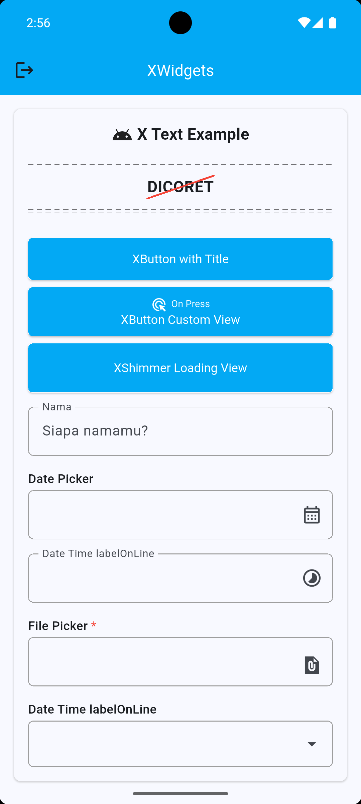

# XWidgets Pack

XWidgets is a Flutter package that provides a curated set of reusable,
customizable UI widgets to accelerate app development and improve
consistency across projects. The library focuses on lightweight, well-documented
components that are easy to style and compose.



## Features

- **XAppBar** — A configurable app bar with title, subtitle, leading and action
  slots. Supports quick theming and layout variants.
- **XButton** — Flexible button supporting primary/secondary variants, icons,
  loading states and custom styles.
- **XCard** — Styled card wrapper with padding, elevation and corner options.
- **XDiagonalStrikethroughText** — Text widget that renders a diagonal
  strikethrough for decorative or sale UI.
- **XDoubleDashedLine** — Two parallel dashed lines for decorative dividers.
- **XSingleDashedLine** — Single dashed divider with spacing and stroke options.
- **XSnackbar** — Convenience wrapper to show stylable snackbars with actions.
- **XSpacer** — Utility widget to insert flexible space between widgets.
- **XTextField** — Enhanced text field with validation hooks and prefined styles.
- **XText** — Convenience text widget consolidating common text styles.
- **XShimmer** - Wrapper widget that provides a smooth shimmer animation effect, commonly
  used for loading placeholders.

## Installation

Add `xwidgets` to your `pubspec.yaml` dependencies:

Or if published on pub.dev, use the latest version:

```yaml
dependencies:
  xwidgets: ^latest
```

Then run:

```bash
flutter pub get
```

## Usage

Import the package and use widgets directly:

```dart
import 'package:xwidgets/xwidgets.dart';

// Use a simple XButton
XButton(
  label: 'Send',
  isLoading: isLoading
  onPressed: () => print('sent'),
);

// AppBar example
XAppBar(
  title: 'Home',
  actions: [IconButton(icon: Icon(Icons.search), onPressed: () {})],
);

// Text field with validation & field type
XTextField(
  controller: myController,
  fieldType: .file
  validator: (v) => v == null || v.isEmpty ? 'Required' : null,
);

// Using XShimmer directly
// Wrap any widget with a shimmer effect
XShimmer(
  child: YourWidget(),
);

// Using XSkeleton for common placeholder needs
// Quick skeleton-style loading block
XSkeleton(
  width: 80,
  height: 80,
);
```

See the `example/` folder for more complete demos.
